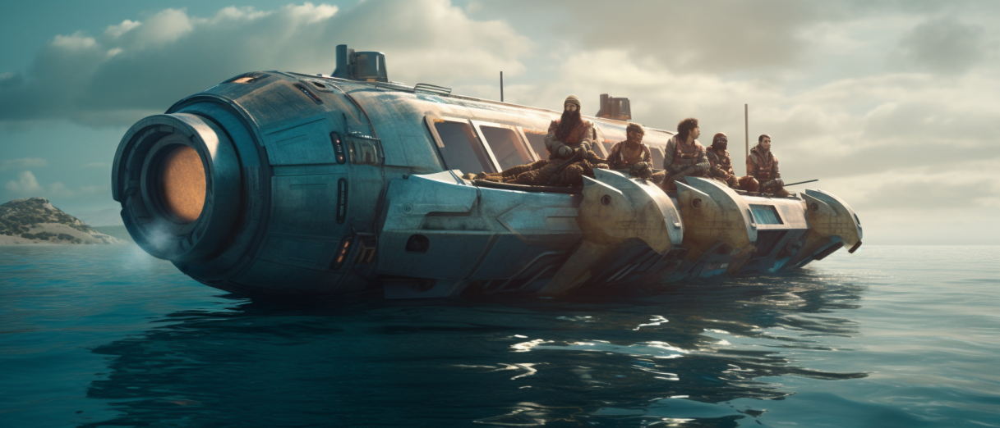

# Creación de personajes

<figure><figcaption></figcaption></figure>

En Concordia no existen clases, profesiones o arquetipos, tampoco listados de habilidades o talentos. Cada personaje es único y se compone de unos pocos elementos.

## Rasgos

El rasgo es el elemento central que distingue a los personajes entre sí. Cada personaje se define por unos pocos rasgos, que son breves descripciones que reflejan su biografía, carrera, aficiones, personalidad o características físicas. Un rasgo es una frase corta que describe lo que caracteriza a ese personaje.


Para entenderlo mejor, imagina que alguien te pide que describas a un amigo o incluso a ti mismo en tan solo cuatro frases. En Concordia, cada una de esas frases sería un rasgo, una característica clave que define al personaje de manera general y concisa.\
\
Tenemos la idea para un personaje inquieto y simpático que se crió en una flota pirata. Podríamos convertir este concepto en tres Rasgos: _Nervioso y alerta como una ardilla_, _Se crió en el océano Índico, en una flota pirata errante_ e _Adulador, irresistiblemente encantador_. El primer rasgo puede servirle para enfrentarse a situaciones en las que prima la velocidad de respuesta, estar alerta o la agilidad. El segundo puede ser de gran utilidad en un entorno marino, o en el área del mundo en que se crió, también puede ayudar en combates así como brindar un conocimiento de los bajos fondos y el mercado negro. El tercero será muy útil en situaciones sociales de todo tipo, seducción, negociaciones, e incluso para hacer contactos y acudir a ellos.


### Niveles de los rasgos

Los rasgos tienen tres posibles niveles que representan su relevancia, rareza e intensidad.

**Rasgo corriente (1d):** representa una característica secundaria del personaje que no representa nada excepcional. Es parte de su identidad, pero no destaca especialmente.

**Rasgo notable (2d):** tiene un papel central para el personaje. Este ha invertido mucho tiempo, esfuerzo o recursos en desarrollarlo y es fundamental para su historia y motivaciones.

**Rasgo extraordinario (3d):** condiciona completamente la vida del personaje y lo hace destacar entre los demás. Es algo único y excepcional, lo que lo puede convertirlo en una figura reconocida en el mundo.

### Distribución de los rasgos

Para empezar a dar forma a tu personaje, elige una distribución de rasgos de entre las siguientes:

**Maestro de nada:** el personaje puede es un individuo polifacético que no destaca en nada en particular. Quizá ha explorado una variedad de actividades sin invertir un tiempo significativo en nada. Tiene **4 rasgos corrientes**.

**Especialista:** el personaje se ha destacado en un campo o característica específicos. Tiene **1 rasgo Notable y 2 corrientes**.

**Unidimensional:** finalmente, el personaje puede jugárselo todo a una carta, poniendo casi todo su enfoque en una característica excepcional. Elige **1 rasgo extraordinario y 1 rasgo corriente**.

## Dominios

Los dominios representan las aptitudes generales de un personaje en cuatro ámbitos. Los dominios se utilizan en todas las tiradas de dados del juego. Los dominios son:

**Cuerpo:** representa las habilidades físicas y la destreza del personaje. Incluye aspectos como la fuerza, la agilidad, la resistencia y el combate cuerpo a cuerpo.

**Mente:** refleja la capacidad mental y el intelecto del personaje. Incluye habilidades cognitivas como el razonamiento, la lógica, la memoria y la resolución de problemas, pero también la voluntad y la sangre fría.

**Entorno:** se relaciona con la interacción del personaje con el entorno que lo rodea. Engloba capacidades como la percepción, la supervivencia, la exploración, la puntería y el manejo de herramientas o tecnología.

**Sociedad:** representa las habilidades sociales y emocionales del personaje. Incluye aspectos como la persuasión, la negociación, la empatía y la capacidad de liderazgo.

Cada uno de estos dominios supone la base de cada tirada de dados. La combinación de estos dominios con los rasgos define las fortalezas y debilidades del personaje.

Los dominios también constituyen la resistencia del personaje a diferentes fuentes de tensión o daño, aunque solo existen tres tipos de daño: físico, mental y social.

### **Distribución de los dominios**

Los dominios **tienen tres posibles niveles:** **bajo (1d), medio (2d) y alto (3d)**. Representan dónde se encuentra el personaje en relación a la media humana en cada uno de esos ámbitos.

Las distribuciones de dominios posibles son:

**Personaje equilibrado:** el personaje no destaca ni por arriba ni por abajo en ningún área. Tiene los **4 dominios a nivel medio**.&#x20;

**Personaje con inclinaciones:** el personaje es bueno en un ámbito en particular y flojea en otro. Posee **1 dominio a nivel alto, 2 a nivel medio y 1 bajo**.

**Personaje extremo:** este personaje no está en la media de nada. Es un personaje con fortalezas notables y debilidades pronunciadas. Tiene **2 dominios a nivel alto y 2 dominios a nivel bajo**.

## Posesiones

En Concordia no hay un inventario exhaustivo de posesiones que los personajes tengan que adquirir de forma explícita. En su lugar, se asume que cada personaje tiene una serie de posesiones típicas en función de su concepto, rasgos y el mundo donde se ambienta el juego.

La idea es que, como jugador, no tengas que preocuparte por cada pequeño objeto o artículo que tu personaje pueda tener en propiedad. En cambio, especifica solo aquellas posesiones o equipamiento inusuales o relevantes para la trama acordadas con el director de juego.
