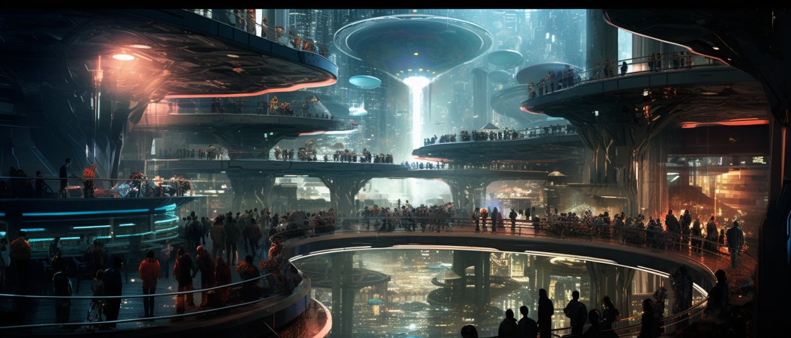

# Introducción

<figure><figcaption></figcaption></figure>

Concordia es un sistema de juego que prima la agilidad y la flexibilidad, y que trata de que el reglamento no sean un obstáculo entre los jugadores y la narración. Para lograrlo, se minimiza el número de tiradas y la cantidad de mecánicas que recordar o consultar. Buscamos que el sistema se adapte a la historia y no al revés.

Para jugar a Concordia tan solo necesitas un puñado de dados de 6 caras. Si es posible, un par de ellos deberían tener diferente color.
