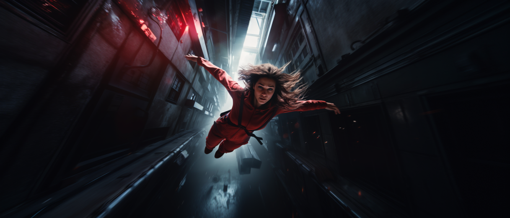

# Daño

<figure><figcaption></figcaption></figure>

Durante el juego, los personajes se pueden exponer a situaciones peligrosas. En Concordia, se considera daño a cualquier efecto negativo sobre un personaje. No se limita al impacto sobre la salud física, sino que puede manifestarse como inseguridad, confusión, ansiedad social, frustración, fiebre, cansancio o desorientación, entre otros muchos.

**Cada fallo en una tirada de dados es susceptible de causar daño a los personajes**, dependiendo de la naturaleza de la situación y su nivel de riesgo. Podemos establecer tres niveles de riesgo, que determinarán el daño recibido en caso de fallo.\
\
**Riesgo limitado:** en una escena de riesgo limitado los personajes se exponen a consecuencias molestas en caso de fallo, pero que no hacen peligrar su integridad ni la continuidad de la narración. Un fallo en una escena de riesgo limitado conlleva **1 punto de daño**.

**Riesgo moderado:** en una escena de riesgo moderado, los personajes pueden encontrarse con consecuencias más significativas. Los daños pueden suponer un impacto grave en su bienestar, pero sin demasiado peligro para su propia existencia. Un fallo implica **2 puntos de daño**.

**Riesgo alto:** en una Escena de alto riesgo, las consecuencias de un fallo pueden ser catastróficas y cambiar notablemente el rumbo de la narración. La propia continuidad de los personajes en la narración puede estar en peligro. El fallo en una escena de alto riesgo supone **3 puntos de daño**.


Morght trata de orientarse y liderar al grupo de personajes por un bosque, pero falla su tirada de entorno. El director puede decidir que durante este infortunado intento se ha golpeado con una rama y se ha abierto una pequeña brecha en la cabeza. O puede considerar que esta confusión ha drenado su confianza, dañando su autoestima. O incluso que el escarnio sufrido por haber perdido al grupo le hace recuperar una tartamudez casi olvidada.


## Revés

Independientemente del éxito o fallo de la tirada, un revés en el dado de sucesos puede convertirse en **un punto de daño** que puede sumarse al daño en caso de fallo, o incluso al daño producido por otro revés.

## Tolerancia

El daño no provoca consecuencias inmediatamente. El daño es absorbido por el contador de tolerancia que corresponda por el tipo de daño (físico o mental).

## Consecuencias

Cuando el daño excede la tolerancia disponible, este se convertirá en una consecuencia. Una consecuencia consiste en una pequeña descripción, igual que un rasgo pero con efectos negativos.

**La cantidad de daño que supera la tolerancia del personaje marca la gravedad de la consecuencia.**

**Consecuencia leve (1 punto de daño):** representa una molestia que no tiene un impacto significativo en la mayoría de actividades del personaje, excepto en situaciones específicas. El personaje tira un dado menos cuando se da esa situación.

**Consecuencia grave (2 puntos de daño):** la consecuencia grave tiene una presencia más notable y afecta a todas las tiradas que involucren el componente físico o mental, según corresponda. En cada una de esas tiradas, el personaje tira un dado menos.

**Consecuencia muy grave (3 puntos de daño):** este nivel de consecuencia tiene un impacto generalizado en todas las acciones del personaje. En cualquier situación, el personaje tira un dado menos. Además, cuando la consecuencia muy grave obstaculiza específicamente un tipo de acción, el personaje tira dos dados menos en esas circunstancias.

Cada personaje tiene espacio para dos consecuencias leves, una grave y una muy grave.

Cuando un personaje recibe una consecuencia y no hay espacio disponible en el nivel de gravedad que le corresponde, se convierte en una de gravedad superior.


Zutano se cae en una zanja tratando de trepar un muro. Recibe 2 puntos de daño. Le queda un solo punto en el contador de tolerancia, por lo que el punto restante pasa a convertirse en una consecuencia leve: tiene la cara llena de heridas y arañazos.\
\
Al ser una consecuencia leve no le afecta demasiado, aunque cuando esa misma noche intenta disuadir a un policía de que le ponga una multa, el aspecto de su rostro juega en su contra.&#x20;


## Incapacitación o muerte

Si un personaje recibe una consecuencia que no puede asignar, el personaje queda fuera de juego, ya sea permanentemente o hasta que lo recuperen.

En ciertas situaciones, la única resolución lógica es la incapacitación o muerte del personaje independientemente de las mecánicas de daño. Cuando el director toma esta resolución debe haber quedado claro a los personajes que este era un posible desenlace.


Francois salta desde un dirigible con el objetivo de atrapar a un contrincante en el aire y quitarle su jetpack, confiando ciegamente en sus capacidades atléticas. La suma de su dominio cuerpo y su rasgo _Acróbata excelente_ se ve limitada por la enorme dificultad de la acción, que le resta dos dados. No logra ningún éxito y el director decide que Francois muere tras una agónica caída de cuatrocientos metros.

