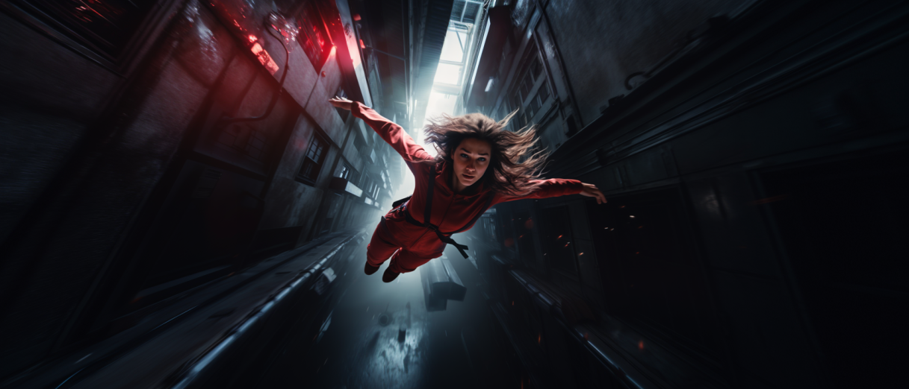

# Daño

<figure><figcaption></figcaption></figure>

Durante el juego, los personajes se pueden exponer a situaciones peligrosas. En Concordia, se considera daño a cualquier efecto negativo sobre un personaje. No se limita al impacto sobre la salud física, sino que puede manifestarse como inseguridad, confusión, ansiedad social, frustración, fiebre, cansancio o desorientación, entre otros.

**Cada fallo en una tirada de dados es susceptible de causar daño a los personajes**, dependiendo de la naturaleza de la situación y su nivel de riesgo. Podemos establecer tres niveles de riesgo, que determinarán el daño recibido en caso de fallo.\
\
**Riesgo limitado:** en una escena de riesgo limitado los personajes se exponen a consecuencias molestas en caso de fallo, pero que no hacen peligrar su integridad ni la continuidad de la narración. Un fallo en una escena de riesgo limitado conlleva **1 punto de daño**.

**Riesgo moderado:** en una escena de riesgo moderado, los personajes pueden encontrarse con consecuencias más significativas. Los daños pueden suponer un impacto grave en su bienestar, pero sin demasiado peligro para su propia existencia. Un fallo implica **2 puntos de daño**.

**Riesgo alto:** en una Escena de alto riesgo, las consecuencias de un fallo pueden ser catastróficas y cambiar notablemente el rumbo de la narración. La propia continuidad de los personajes en la narración puede estar en peligro. El fallo en una escena de alto riesgo supone **3 puntos de daño**.


Morght trata de orientarse y liderar al grupo de personajes por un bosque, pero falla su tirada de entorno. El director puede decidir que durante este infortunado intento se ha golpeado con una rama y se ha abierto una pequeña brecha en la cabeza. O puede considerar que esta confusión ha drenado su confianza, dañando su autoestima. O incluso que el escarnio sufrido por haber perdido al grupo le hace recuperar una tartamudez casi olvidada.


## Revés

Independientemente del éxito o fallo de la tirada, un revés en el dado de sucesos puede convertirse en **un punto de daño** que puede sumarse al daño en caso de fallo, o incluso al daño producido por otro revés.

## Tolerancia

El daño recibido no provoca consecuencias inmediatamente. Cada personaje tiene niveles de tolerancia para daño físico y mental asociados al valor de sus dominios Cuerpo y Mente.\
\
Cuando el personaje recibe daño, lo asigna al contador de tolerancia que corresponda por el tipo de daño. Solo si el daño excede la tolerancia disponible, este se convertirá en consecuencias.

## Consecuencias

El daño que el personaje recibe tiene carácter narrativo y se representa mediante secuelas. Parecido a un rasgo, **una secuela consiste en una pequeña descripción y un nivel de gravedad**.

Existen cuatro espacios para secuelas: **dos leves, una grave y una muy grave**. Cuando un personaje recibe una secuela y no hay espacio disponible en el nivel de gravedad que le correspondería, se convierte en una secuela de gravedad superior.

Si se recibe una secuela y no queda ningún espacio disponible, el personaje queda fuera de juego, ya sea permanentemente o hasta que lo rehabiliten.


Ejemplos de secuelas son una herida de bala, un brazo roto, agotamiento, hipotermia, ansiedad social, cojera por esguince, descoordinación, agujetas, baja autoestima, un problema en el habla, sordera, fiebre, desorientación.

